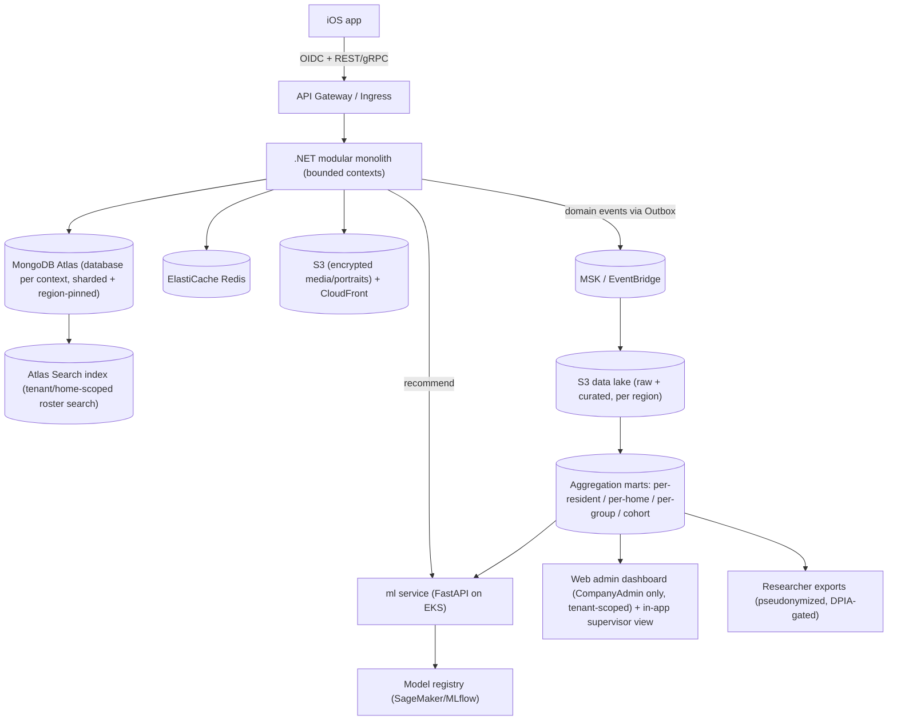

# NoteStalgia / Mellority Flow — Production Implementation Plan

> Execution target: a later date, by another engineer/agent. This document plus a per-repo `README.md` and a central `docs/decisions/` (ADR) log are living artifacts — update the decision log on every major change.
>
> Code references below are paths within the `MellorityFlowPOC` repository root (this file lives in `docs/`).

## 1. Context (what exists today)

The POC is a single SwiftUI iPad app for music-reminiscence in UK care homes. Everything is in-memory and on-device. The current iteration has grown a real (mocked) tenancy + roster model that the production design must mirror:

- Monolithic state object `Core/SessionPOCState.swift` (~1000+ lines) holds all flow, auth, tenancy, roster, session, discovery, and group state (`currentHomeId`, `rosterSearchQuery`, `rosterSelectedWingId`, `rosterPinnedResidentIds`, `rosterRecentlyViewedIds`, `rosterDisplayMode`).
- **Tenancy model in `Core/CareTenancyModels.swift`:** `CareOrganisation` (email domains) -> `CareHome` (with `wings`) -> `SupervisorAccount` (roles `supervisor`/`homeLead`/`orgAdmin`, `homeIds`, `pin`, `email`). Residents now carry `homeId`, `wingId`, `roomLabel`, `isActive`. Mock data seeds an org (Sunrise Care Group) with two homes and ~34 residents.
- **Roster + patient search engine in the same file (`CareRosterEngine`):** client-side substring `matchesSearch` over name + room + wing + care-context; sections for **pinned / recent / due / wing / search results / all residents**; per-home scoping; limits (`searchResultsLimit = 40`, `todaySectionLimit = 20`). UI in `Screens/CareStaffScreens.swift` (`CarePatientListView`: search field "Search name, room, or wing", wing chips, display-mode picker, browse-all).
- PII/health data models in `Core/CareStaffModels.swift` (resident names, photos, care notes, wellbeing ratings).
- **Auth is email + PIN** against the org in `Core/SupervisorAuth.swift` (`validate(email:pin:)`), with multi-home supervisors and a home switcher — no longer the old hardcoded username/PIN.
- Placeholder CC audio + disk cache in `Core/StreamAudioCache.swift` and `Core/DiscoveryModels.swift`.
- Heuristic genre recommender in `Core/DiscoveryPlaylistTuning.swift` — the seed for the real recommender.
- Face ID linking (`Core/PatientFaceIDSignInControls.swift`, to be **removed** — auth is PIN-only), IoT room prep (**out of scope**), group-session compiler scattered through `Core/` and `Screens/`.

**Alignment note:** the POC's org/home/wing/role tenancy already matches this plan's model (Sections 4-6). The plan's `CompanyAdmin` ~= POC `orgAdmin`, `HomeAdmin` ~= `homeLead`, `Supervisor` ~= `supervisor`. Production formalises this with time-bounded home assignments (Section 5) and moves the client-side roster/search engine to a governed server-side capability (Section 5.1).

**Data sensitivity:** resident PII + special-category (health) data. GDPR Art. 9 applies. This drives the entire architecture. (No biometric data is collected — authentication is PIN-based.)

## 2. Architecture decisions (confirmed)

- **Cloud:** AWS, primary region `eu-west-2` (London) for UK residency; `eu-central-1`/`eu-west-1` for EU; expansion regions added per market.
- **Data store:** **MongoDB (document/NoSQL)** via **MongoDB Atlas** — Global Clusters for zone-based data residency, native sharding for horizontal scale, and Queryable Encryption/CSFLE for PII (Amazon DocumentDB is the fallback if a single-vendor AWS-native stack is later required).
- **Compute:** Kubernetes (EKS) for backend + ML, multi-region, GitOps-managed.
- **ML:** phased recommender (heuristic -> classical ML -> deep learning) behind one stable serving interface.
- **Auth:** in-house, OWASP ASVS-aligned, but OIDC-shaped so Auth0/Cognito is a config-level swap later.
- **Backend style:** modular monolith with strict DDD bounded contexts (Clean Architecture per context) — split into services only when a context demands it (YAGNI). One deployable now, clean seams to peel off later.
- **Target scale:** designed to serve the **entire UK market — up to ~17,000 care homes** (and beyond, internationally) without re-architecture. Capacity envelope, SLOs, and resilience patterns are in Section 12.

## 3. Repositories to create

Start with the two requested; the rest are scaffolded as the plan progresses.

- `notestalgia-ios` — SwiftUI app, modular via Swift Package Manager.
- `notestalgia-backend` — .NET (latest LTS) modular monolith, DDD bounded contexts.
- `notestalgia-web` — web admin dashboard for care-home-company supervisors/admins (insights, rosters, exports); access locked to company-admin roles, scoped to the company's own tenant data (see Sections 6 and 8).
- `notestalgia-infra` — Terraform IaC (AWS, EKS, multi-region, networking, data stores).
- `notestalgia-ml` — Python (FastAPI) model-serving + training pipelines + MLOps.
- `notestalgia-contracts` — single source of truth for API (OpenAPI) + domain events (JSON Schema/Avro); generates iOS + web + backend + ml clients.

Each repo gets: `README.md` (engineer onboarding + decisions), `AGENTS.md` + `.cursor/skills/` (agent conventions), `docs/decisions/` ADRs (MADR format), CODEOWNERS, conventional-commit + lint pre-commit hooks, and CI gates.

## 4. Backend domain boundaries (.NET)

Bounded contexts (each = folder/module with `Api`, `Application` (CQRS via MediatR + FluentValidation), `Domain`, `Infrastructure` (MongoDB .NET driver + repository per aggregate)):

- **Identity & Access** — supervisors/staff, orgs, sessions, tokens, RBAC, and **staff onboarding** (invitations, account activation, PIN enrolment, role + home assignment, training acknowledgement). PIN-based auth only (no biometrics).
- **Care Organisation** — care groups/companies, homes, regions, device/MDM registration, tenancy. Models **time-bounded home assignments** for both residents and staff (not a hard single-home foreign key): a resident or supervisor belongs to the **company** (the tenant), and has a current + historical set of **home memberships** with effective dates and a `temporary` flag, so transfers and short-term cover are first-class (see Section 5).
- **Resident Profile** — person-centred profiles, sensory prefs, portraits (replaces `CarePatientProfile`; no biometric/Face ID linking). The profile follows the resident across homes within the same company; the home a session happened in is recorded on the session, not the profile.
- **Sessions** — one-to-one, discovery calibration, group sessions, live telemetry (replaces flow logic in `SessionPOCState`).
- **Wellbeing & Outcomes** — 1-10 ratings, longitudinal analytics, researcher export (DPIA-gated).
- **Media & Streaming** — catalog abstraction, era-matched search, signed playback tokens (vague impl, real hooks).
- **Recommendations** — gateway to the ML service; ports `DiscoveryPlaylistTuning` as the v0 heuristic model.
- **Insights & Aggregation** — read-side context that turns raw session/playlist/wellbeing events into governed, queryable aggregates for care-home dashboards and researcher cohorts (see Section 8). Owns the semantic metric definitions so "engagement", "agitation trend", "genre uptake" mean the same thing everywhere.
- **Consent & Privacy** — consent records, lawful basis, DSAR automation, retention/erasure, audit log.
- **Notifications** — staff/admin notifications and event fan-out. (IoT/room orchestration is **out of scope**.)

Cross-cutting: Result/Problem-Details error model, MediatR pipeline behaviors (validation, logging, auth), transactional **Outbox** for domain events, OpenTelemetry everywhere.

## 5. Data & persistence patterns

- **Operational store:** **MongoDB Atlas (document/NoSQL)**, **database-per-bounded-context** with collections per aggregate. Model around access patterns: embed tightly-coupled child data in the aggregate document, reference across contexts by id (no cross-context joins — contexts own their data). Enforce structure with **JSON Schema validators** + a `schemaVersion` field per document; "migrations" are versioned, idempotent transform scripts checked into the repo (lazy/on-write upgrades where possible).
- **PII strategy:** explicit PII/special-category field tagging; **MongoDB Queryable Encryption / CSFLE** with **per-subject data encryption keys** in a KMS-backed key vault (AWS KMS as the CMK) to enable crypto-shredding (erasure = destroy the subject key). Append-only audit collection.
- **Cache/session:** ElastiCache Redis.
- **Blobs:** S3 (SSE-KMS) for portraits/media + CloudFront, signed URLs only.
- **Analytics/research:** domain events -> S3 data lake -> curated aggregation marts (full pipeline in Section 8). OLTP and analytics are deliberately separated so heavy reporting never touches the resident-facing transactional path.
- **Multi-tenancy & scale:** tenant = **care-home company** (residents and staff belong to the company, homes are sub-units within it); every document carries a `tenantId` (+ `homeId` where relevant) with tenant isolation enforced at the repository layer. **Shard on a `tenantId`-based key** and use **Atlas Global Clusters with zone sharding** to pin each tenant's data to its required region (UK/EU residency) — this is also the horizontal-scale mechanism for the "thousands of homes" target.
- **Home mobility (residents + staff):** model membership as an append-only **assignments collection** (`subjectId`, `homeId`, `effectiveFrom`, `effectiveTo` nullable, `isTemporary`) rather than a single `homeId` field. Current home = the open-ended document; transfers and temporary cover just open/close documents, preserving full history. A supervisor's effective home scope (Section 6) is derived from their active assignments, so temporary moves automatically grant/revoke the right access without manual cleanup.

### 5.1 Roster patient search (data + infrastructure)

The POC does this **client-side** (`CareRosterEngine.matchesSearch` substring-scans an in-memory list). That works for ~34 mock residents but is wrong at production scale and for PII governance: a device must never hold a whole home's/company's roster to search it, and PII search is itself an access event that must be authorised and audited. Production makes search a **governed, server-side capability**.

- **Search backend — MongoDB Atlas Search (native).** Use Atlas Search (Lucene indexes built into the same cluster) rather than standing up a separate OpenSearch/Elasticsearch system (YAGNI — no extra infra, no second copy of PII, no separate DR story). It gives **prefix/autocomplete, fuzzy/typo tolerance, diacritic folding, and relevance ranking** over the residents collection. OpenSearch remains the documented escalation path only if cross-org platform-admin or advanced relevance later demands it.
- **What's searchable vs. encrypted (the key PII decision).** Split resident fields:
  - **Searchable identifiers** — `displayName`, `roomLabel`, `wingId`/wing name, care-context label. These are minimally-sensitive *operational* fields; keep them queryable (protected by at-rest encryption + strict tenant/RBAC scoping + audit), because CSFLE/Queryable Encryption does **not** support substring/prefix search.
  - **Special-category fields** — care notes, wellbeing ratings, health themes — stay **CSFLE-encrypted and are never indexed or searchable**. Search returns *identity + location* only; opening a profile is a separate, separately-authorised read.
  - If policy later requires names to be encrypted too, the fallback is a **blind index** (HMAC token index with per-tenant keys) supporting equality/prefix lookups without exposing plaintext — noted as an option, not built by default (KISS).
- **Hard tenant + home scoping.** Every query is constrained server-side to the caller's `tenantId` and their **assignment-derived home scope** (Section 5/6): a `Supervisor` searches their current home; a `HomeAdmin`/`homeLead` searches their assigned homes; `CompanyAdmin`/`orgAdmin` searches the whole company. Scope is applied as a mandatory Atlas Search `filter` (compound query), never trusting a client-supplied scope. Only `isActive` residents by default.
- **Search reflects mobility & erasure.** Because "current home" is derived from the open-ended assignment document, a transferred resident appears under their new home automatically. Crypto-shredded/erased residents (Section 7) are removed from the index via the same event pipeline (tombstone on erasure), so they can never surface in results.
- **Index freshness via the event pipeline.** The Atlas Search index updates from resident create/update/transfer/erase events (Outbox -> change stream), so search stays consistent with the operational store without bespoke sync code.
- **API shape & performance.** A single `GET /homes/{homeId}/residents/search?q=&scope=&page=` (and a company-scoped variant) returning paged, ranked, projection-limited results (id, name, room, wing, thumbnail ref, last-session/due flag). Server-side pagination + result caps (mirroring the POC's `searchResultsLimit`), Redis-cached hot/empty queries, and **debounced (~250 ms) prefix queries** from the iPad/web client. The roster's **pinned / recent / due / wing** sections stay as separate, cheap read-model queries (CQRS) — search is only invoked when the user types.
- **Auditing.** Every resident search (query text hash, scope, result count, actor) is written to the append-only audit log — searching PII is a DSAR-relevant access event.
- **Client behaviour.** iOS/web keep only the *current view* of results (never a full roster), call the search API with async/await + cancellation of superseded queries, and degrade gracefully offline to the locally-cached recent/pinned residents only.

## 6. Security (OWASP) & auth abstraction

- **Authentication is PIN-based — no biometrics/Face ID.** Custom auth service issuing **OIDC-compliant** JWT access + refresh tokens; staff sign in with **email + PIN** (matching the current POC `SupervisorAuth.validate(email:pin:)`; PIN Argon2id-hashed, never stored in plaintext), replacing the demo flow. PINs have lockout/throttling and rotation policies; an optional account password is used only for web-dashboard recovery/admin. The POC's Face ID resident linking is dropped — residents start sessions via supervisor handoff.
- Behind `IIdentityProvider` / standard OIDC discovery so swapping to Auth0/Cognito later is config, not code.
- **Role model (RBAC + tenancy):** roles are scoped to a tenant (care-home company). Core roles: `Supervisor` (floor staff, iPad sessions), `HomeAdmin` (one home), `CompanyAdmin` (whole care-home company — the web dashboard audience), and internal `PlatformOperator`/`Researcher`. The **web dashboard is locked to `CompanyAdmin` (and optionally `HomeAdmin`) roles only**, and every query is hard-scoped to the caller's own company tenant — one company can never see another's residents or aggregates. Enforced centrally (policy/claims in the auth layer + row-level tenant filters), not per-screen.
- **Home scope follows assignments:** a `Supervisor`/`HomeAdmin`'s accessible homes are derived from their **active home assignments** (Section 5), not a static field. A temporary transfer grants access to the new home for the assignment window and revokes it automatically when the window closes — no orphaned permissions. `CompanyAdmin` always spans the whole company.
- OWASP ASVS controls: rate limiting, lockout, RBAC + least privilege, input validation (FluentValidation), output encoding, security headers, dependency scanning (CI), secrets in AWS Secrets Manager, AWS WAF + Shield, mTLS between services.
- Automated security gates in CI: SAST, dependency audit, container scan, IaC scan.

**Staff onboarding flow (web dashboard):** a `CompanyAdmin` (or `HomeAdmin`, within their homes) invites a new staff member from `notestalgia-web` -> the system issues a single-use, expiring invite (email/SMS) -> the invitee activates their account and sets their PIN (plus an optional recovery password for the web dashboard) -> they are assigned a role and one or more (optionally temporary) home assignments -> they acknowledge required training/data-handling terms (captured for compliance) -> account becomes active and immediately scoped per Section 5/6. Invites, activations, role/assignment changes, and revocations are all written to the immutable audit log. Off-boarding/suspension is the same flow in reverse (closes assignments, revokes tokens).

## 7. GDPR & data-retention automation (first-class)

- **Consent & Privacy** context owns: consent + lawful-basis records, **automated DSAR** (access, portability, erasure) endpoints, **retention policies as code** with scheduled TTL/anonymization jobs, crypto-shredding on erasure, immutable audit trail.
- DPIA + Record of Processing maintained in `docs/compliance/`.
- Data residency enforced at the routing + storage layer (region pinning by tenant).

## 8. Insights & data aggregation (researchers + care homes)

This is a first-class capability, not a reporting afterthought — it is what makes the platform valuable to care homes (operational dashboards, CQC/family evidence) and researchers (cohort outcomes, the pitch deck's evaluation study). It feeds the recommender too, so the same pipeline serves three consumers.

**Event-first capture (the foundation).** Every meaningful action emits a typed, versioned domain event via the transactional **Outbox** — discovery snippet sentiment, track/genre played, track changes, immersive entries, session start/stop + duration, wellbeing ratings (mood/alertness/emotional/lucidity), group morale/engagement. These mirror today's `ResidentSurfaceSessionMetrics` and `CareSessionRecord` fields but become durable, append-only facts. Event schemas live in `notestalgia-contracts` so producers and the aggregation layer never drift.

**Pipeline (medallion / lakehouse pattern).**

- **Raw (bronze):** events land in the region-pinned S3 data lake exactly as emitted.
- **Curated (silver):** cleaned, conformed, pseudonymized fact tables (one resident pseudonym per subject key) partitioned by tenant + time.
- **Aggregation marts (gold):** pre-computed rollups at the grains that matter — **per-resident**, **per-home**, **per-care-company**, and **anonymized cross-home cohort**. Built incrementally (dbt-style transforms on Athena/Redshift) so aggregates stay cheap and fresh.

**Mobility-correct attribution.** Because residents and staff move homes (Section 5), every event records the **home it occurred in at the time** (not the subject's current home). Per-home rollups therefore stay historically accurate after a transfer, while per-resident rollups follow the resident across homes within the company — giving care homes a true picture of activity in *their* building and researchers an unbroken longitudinal record per resident.

**Standardised metrics (defined once).** The Insights & Aggregation context owns a single semantic definition of each metric — usage (session frequency, duration, completion), playlist/genre engagement (genre uptake, skip/change rate, favourite drift, discovery-to-retention), and wellbeing trends (rating trajectories, agitation/PRN proxies) — and the correlation views care homes and researchers actually want (e.g. *genre engagement vs. wellbeing trend over time*). One definition prevents the "every dashboard computes engagement differently" problem.

**Two governed consumers, two access paths.**

- **Care homes:** low-latency aggregates served back through the backend API into the in-app supervisor view and the **`notestalgia-web` admin dashboard**. The web dashboard is the richer reporting surface (trends, drill-down by home/resident, CSV/PDF export) and is **restricted to `CompanyAdmin` (and optionally `HomeAdmin`) roles, hard-scoped to that company's own tenant** (Section 6). Daily/near-real-time operational views.
- **Researchers:** pseudonymized, **DPIA- and consent-gated**, k-anonymity-thresholded cohort exports (suppress small cells) with full audit logging of every export. Aggregation respects erasure — crypto-shredded subjects drop out of future rollups.

**Why this design:** OLTP stays lean; aggregation is reproducible, versioned, and re-runnable from raw events; new questions become new gold transforms (no schema migrations on the live path); and the exact same curated layer powers recommender features (Section 9), avoiding duplication.

## 9. Recommender / "neural network" (phased, industry MLOps)

- `notestalgia-ml` (FastAPI) exposes a **stable scoring contract**; backend calls it via `IRecommendationService`.
- **Phase A:** port `DiscoveryPlaylistTuning` heuristic behind the contract (ship value immediately).
- **Phase B:** classical ML (gradient-boosted ranking) on discovery feedback + session telemetry.
- **Phase C:** deep-learning sequence/embedding recommender (era + sentiment + engagement).
- **MLOps:** features are sourced from the **curated/gold aggregation layer (Section 8)** — no separate ingestion — then a **feature store**, **model registry** (SageMaker or MLflow), offline eval + champion/challenger A/B, drift + performance monitoring, reproducible training in CI. Models are versioned and swappable with zero backend change.

## 10. iOS re-architecture

- Decompose `SessionPOCState` into **feature modules (SPM)** mirroring backend contexts; MVVM + unidirectional data flow + the Observation framework; `async/await` + actors throughout (replaces the manual `Task`/`@Published` orchestration).
- **Offline-first** (care floors have poor Wi-Fi): SwiftData/Core Data local store + repository layer with async APIs + background sync/outbox to backend. The same outbox reliably ships usage/playlist telemetry events (Section 8) even when sessions happen offline.
- **Networking:** generated OpenAPI client (from `notestalgia-contracts`), structured concurrency, typed errors, retry/backoff.
- **Audio/visual streaming:** keep vague but wire real seams — `MediaStreamingProvider` protocol over `AVPlayer`, token-based playback from Media context, prefetch hooks evolving today's `StreamAudioCache`.
- Accessibility-first preserved (VoiceOver, Reduce-Motion) as a module-level contract + tests.

## 11. Infrastructure, deployment & observability

- **IaC:** Terraform in `notestalgia-infra` — VPCs, EKS clusters per region, **MongoDB Atlas (Terraform Atlas provider: Global Clusters, zone sharding, PrivateLink peering)**, ElastiCache, S3/CloudFront, MSK/EventBridge, KMS, WAF, Secrets Manager.
- **Deploy:** GitHub Actions CI -> container images -> **GitOps (ArgoCD)** to EKS; trunk-based; dev/staging/prod; blue-green/canary.
- **Scale:** HPA/Karpenter, multi-region active-active for stateless tier, Atlas sharded Global Clusters for data; cell-based tenancy seam.
- **Observability (engineer + monitoring agent friendly):** OpenTelemetry traces, structured JSON logs (Serilog) with correlation IDs, Prometheus/Grafana + CloudWatch, health/readiness probes, runbooks in `docs/runbooks/`.

## 12. Resilience & scale to 17,000 UK care homes

This is an explicit, testable target. The numbers below show the load is modest for a horizontally-scaled, event-driven design — the work is in *proving* it and engineering for failure, not in exotic capacity.

**Load model (conservative back-of-envelope).**

- ~17,000 homes x ~50 residents ~= **850k resident profiles**; with staff, low single-digit millions of accounts.
- Sessions are short and human-paced. Even if every home runs sessions through the day, realistic **peak concurrency is ~20k-60k active sessions**; telemetry is a handful of small events per session. That is **low-thousands of writes/sec at peak** and mostly cacheable reads — comfortably within a sharded Atlas + autoscaled stateless tier.
- Heavy media bytes are served by **CloudFront/CDN + on-device caching**, not the app tier, so audio streaming scale is decoupled from the API.

**Scalability mechanisms (already in the plan, made explicit here).**

- **Stateless API/ML pods on EKS** behind HPA + Karpenter — scale horizontally on CPU/RPS/queue-depth; no sticky state.
- **MongoDB Atlas sharding on a `tenantId`-derived key** distributes 17k tenants across shards; add shards to add capacity (near-linear). Hot tenants isolated; reads served from secondaries where safe.
- **Partitioned event streaming** (MSK/EventBridge) keyed by tenant for parallel, ordered-per-tenant processing; the analytics/aggregation path (Section 8) is fully decoupled so reporting load never touches the resident-facing path.
- **Read models / CQRS + Redis caching** keep dashboard and roster reads cheap at fan-out.
- **Cell-based architecture seam:** tenants are grouped into independently-scalable cells, capping the blast radius of any single failure and giving a clean path to many millions of users.

**Resilience patterns (engineered for failure).**

- **Multi-AZ everywhere** (EKS node groups + Atlas replica sets across >=3 AZs); **active-active multi-region** for the stateless tier, region-pinned data per residency.
- **Fault isolation in-process:** Polly-based **timeouts, retries with jitter, circuit breakers, and bulkheads** on every outbound dependency; **idempotency keys + the transactional Outbox** make retries safe and prevent double-writes.
- **Graceful degradation:** the iPad app is **offline-first** — a backend or network outage does not stop a resident's session; telemetry queues locally and syncs later. Non-critical features (recommender, dashboards) fail soft without breaking core playback.
- **Load shedding & abuse protection:** per-tenant rate limiting, request quotas, and queue-based backpressure so one busy company can't degrade others ("noisy neighbour" protection).
- **Backups & DR:** Atlas continuous backups + point-in-time restore; documented **RTO/RPO targets** (e.g. RPO <= 5 min, RTO <= 1 hr) validated by periodic restore drills; infra is reproducible from Terraform.
- **SLOs + error budgets:** define availability/latency SLOs (e.g. 99.9% API availability, p95 read < 300 ms), wired to the Section 11 observability stack with alerting and runbooks.

**Validation (don't just assert it — test it).**

- **Load/soak testing** to 2-3x the projected 17k-home peak in CI/staging (k6/Gatling) before each major release.
- **Chaos engineering** (pod/AZ/region kill, dependency latency injection) to verify the resilience patterns actually hold.
- Capacity headroom and autoscaling policies reviewed against real telemetry as homes onboard.

## 13. DevEx, linting/formatting, agent skills, docs

- **Backend:** `.editorconfig`, Roslyn analyzers + StyleCop, `dotnet format`; **iOS:** SwiftLint + SwiftFormat; **ml:** ruff + black + mypy. All enforced via pre-commit + CI.
- **Agent skills:** per-repo `.cursor/skills/` (e.g. `add-bounded-context`, `add-endpoint`, `add-ios-feature-module`, `add-migration`, `update-decision-log`) + `AGENTS.md` so agents and engineers follow identical patterns with no drift.
- **Docs:** large root `README.md` per repo (architecture, domains, local setup, conventions) + central **decision log** (`docs/decisions/NNNN-*.md`, MADR) updated on every major change.

## 14. Sequencing

Foundation (repos, tooling, contracts, docs, skills) -> backend domain skeleton + data layer -> identity/auth -> consent/GDPR/retention -> sessions/wellbeing/export -> event capture + insights/aggregation pipeline + dashboards -> roster server-side search -> media abstraction -> recommender (Phase A) + MLOps -> iOS re-architecture -> infra/EKS/multi-region -> observability + security + compliance hardening -> multi-tenancy/i18n/scale + resilience validation (load/chaos to 17k-home peak) -> recommender Phases B/C.

> Sequencing note: the **event-first capture** (Section 8) ships alongside the Sessions/Wellbeing contexts so real facts accumulate from day one; the aggregation marts, dashboards, and researcher exports build on top once enough data flows.

## 15. Implementation todos (checklist)

- [ ] **foundation** — Create the 6 repos (lead with notestalgia-ios + notestalgia-backend; then web, infra, ml, contracts). Add per-repo README, AGENTS.md, .cursor/skills/, docs/decisions (ADR/MADR) + first ADRs (AWS, EKS, MongoDB/NoSQL via Atlas, phased ML, custom-OIDC auth, modular monolith), CODEOWNERS, conventional-commit + lint pre-commit hooks, and baseline CI.
- [ ] **tooling-contracts** — Set up linting/formatting/test/CI gates per repo (EditorConfig + Roslyn/StyleCop + dotnet format; SwiftLint + SwiftFormat; ruff/black/mypy). Stand up notestalgia-contracts (OpenAPI + versioned domain/telemetry event schemas for usage, playlist, and wellbeing facts) with client generation for iOS, backend, and ml.
- [ ] **backend-skeleton** — Scaffold the .NET modular monolith with bounded contexts (Identity, Care Org, Resident Profile, Sessions, Wellbeing, Media, Recommendations, Insights & Aggregation, Consent & Privacy, Notifications), Clean Architecture per context, MongoDB .NET driver + repository per aggregate, MediatR + FluentValidation pipeline, Result/ProblemDetails, transactional Outbox, OpenTelemetry.
- [ ] **data-layer** — MongoDB Atlas database-per-context (collections per aggregate, JSON Schema validators + schemaVersion + versioned transform scripts), Queryable Encryption/CSFLE with per-subject keys in a KMS-backed key vault (crypto-shred ready), tenantId-based sharding + Global Cluster zone pinning for residency, Redis cache, S3+CloudFront for media/portraits, and the domain-event -> data-lake pipeline. Model home membership as an append-only, time-bounded assignments collection (subjectId, homeId, effectiveFrom/To, isTemporary) for both residents and staff; tenant = care-home company.
- [ ] **identity-auth** — In-house OIDC-shaped auth with PIN-based sign-in only (Argon2id-hashed PINs, lockout/throttling/rotation, refresh tokens; no biometrics/Face ID) behind IIdentityProvider for future Auth0/Cognito swap. Tenant-scoped RBAC (Supervisor/HomeAdmin/CompanyAdmin/PlatformOperator/Researcher) where home scope is derived from active assignments (temporary moves auto-grant/revoke). OWASP ASVS controls + CI security gates.
- [ ] **staff-onboarding** — CompanyAdmin/HomeAdmin sends single-use expiring invites from the web dashboard; invitee activates account, sets PIN (plus optional recovery password), gets role + (optionally temporary) home assignments, and acknowledges training/data-handling terms. All invites/activations/role+assignment changes/revocations audit-logged; off-boarding closes assignments and revokes tokens.
- [ ] **gdpr-consent** — Consent & Privacy context: consent/lawful-basis records, automated DSAR (access/portability/erasure via crypto-shredding), retention-as-code with scheduled anonymization jobs, immutable audit log, and DPIA/RoPA docs under docs/compliance.
- [ ] **sessions-outcomes** — Port session flows (one-to-one, discovery calibration, group) + telemetry and the Wellbeing & Outcomes context. Record the home each session occurred in (mobility-correct attribution) and emit every usage/playlist/wellbeing action as a typed, versioned Outbox event.
- [ ] **insights-aggregation** — Medallion pipeline (raw -> curated/pseudonymized -> per-resident/home/group/cohort gold marts via dbt-style transforms on Athena/Redshift), one canonical set of usage/playlist/wellbeing metric definitions, low-latency aggregate APIs (tenancy/RBAC-scoped), and k-anonymity-thresholded, DPIA/consent-gated, fully-audited researcher exports that honour erasure.
- [ ] **roster-search** — Move roster patient search server-side (Section 5.1): MongoDB Atlas Search index over searchable identifiers (name/room/wing/context) with prefix/fuzzy/diacritic folding + relevance; keep special-category fields CSFLE-encrypted and non-indexed. Enforce hard tenant + assignment-derived home scoping as mandatory filters, reflect mobility (current-home) and erasure (tombstone) via the event pipeline, expose paged/ranked search APIs (GET /homes/{homeId}/residents/search) with server-side pagination + result caps + Redis caching, debounced cancellable client queries, and audit every PII search. Keep pinned/recent/due/wing as separate CQRS read-model queries.
- [ ] **web-dashboard** — Build notestalgia-web: web admin dashboard for care-home-company supervisors. Access locked to CompanyAdmin (and optionally HomeAdmin) roles via the OIDC auth layer, with every request hard-scoped to the caller's own company tenant. Surfaces usage/playlist/wellbeing trends, drill-down by home/resident, CSV/PDF export, plus staff-invite/onboarding and home-assignment (incl. temporary transfer) management UIs. Consumes Section 8 aggregate APIs via the generated OpenAPI client.
- [ ] **media-abstraction** — Media & Streaming context with a provider-agnostic catalog/playback abstraction and signed playback tokens (keep the licensed-provider impl vague but wire all hooks), evolving today's StreamAudioCache prefetch model.
- [ ] **recommender-mlops** — Stand up notestalgia-ml (FastAPI) with a stable scoring contract; port DiscoveryPlaylistTuning as the Phase-A heuristic model. MLOps foundation: features sourced from the curated/gold aggregation layer (no separate ingestion), feature store, model registry, offline eval + A/B, drift monitoring.
- [ ] **ios-rearchitecture** — Decompose SessionPOCState into SPM feature modules mirroring backend contexts, MVVM + Observation + async/await/actors, offline-first SwiftData store with repository + background sync, generated OpenAPI client, MediaStreamingProvider over AVPlayer, accessibility contracts + tests.
- [ ] **infra-deploy** — notestalgia-infra (Terraform): multi-region VPC/EKS, MongoDB Atlas (Atlas provider: Global Clusters, zone sharding, PrivateLink), ElastiCache, S3/CloudFront, MSK/EventBridge, KMS, WAF/Shield, Secrets Manager. GitHub Actions CI -> ArgoCD GitOps deploy, HPA/Karpenter autoscaling, blue-green/canary, dev/staging/prod.
- [ ] **observability-hardening** — Observability for engineers + monitoring agents (OTel traces, structured JSON logs + correlation IDs, Prometheus/Grafana/CloudWatch, health probes, runbooks) and complete security/compliance hardening + penetration-test readiness.
- [ ] **scale-tenancy** — Multi-tenancy + region pinning (tenant = care-home company), tenantId-based Atlas sharding and cell-based seam sized for ~17,000 UK homes (and international), and internationalization/localization for UK-then-international rollout. Then advance recommender to Phase B (classical ML) and Phase C (deep learning).
- [ ] **resilience-validation** — Engineer and prove resilience for the 17,000-home target (Section 12): multi-AZ + active-active multi-region for stateless tier, Polly timeouts/retries/circuit-breakers/bulkheads + idempotency, per-tenant rate limiting/backpressure, offline-first graceful degradation, Atlas continuous backup + PITR with documented RTO/RPO and restore drills, SLOs/error budgets, plus load/soak testing to 2-3x projected peak and chaos engineering (pod/AZ/region kill) in CI/staging.
